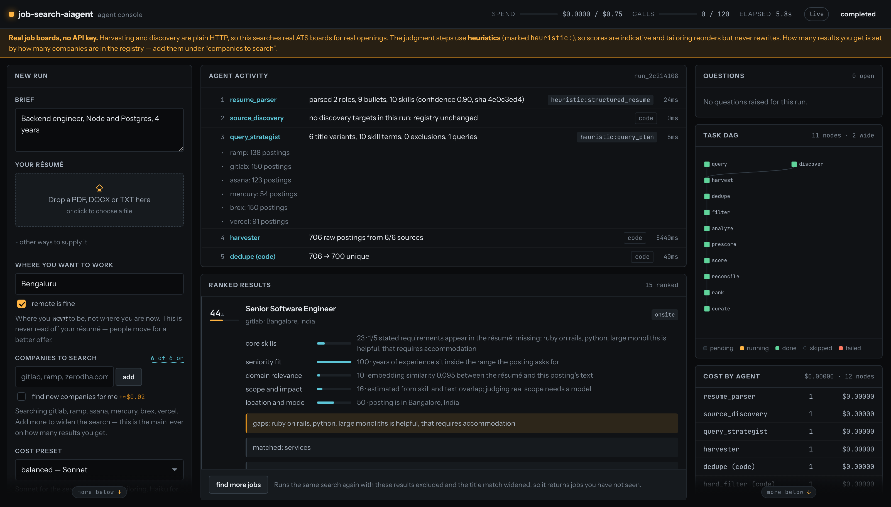
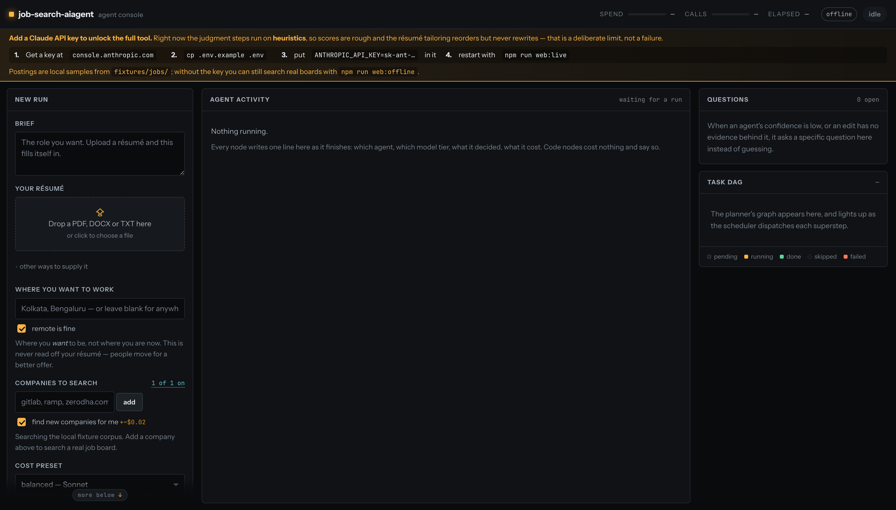
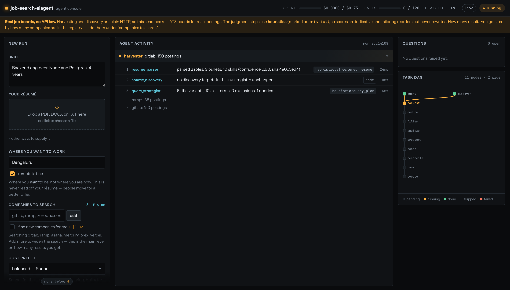
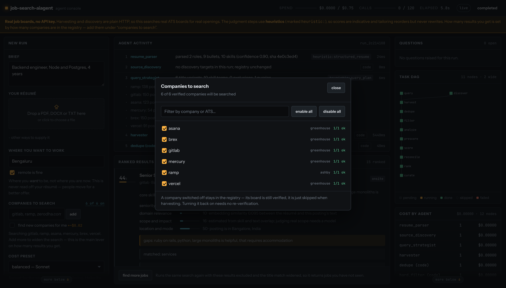

<div align="center">

# job-search-aiagent

**A multi-agent job search that reads real job boards, scores every posting against your résumé with an explanation, and tailors your CV without inventing a word of it.**

Runs on your machine. Real job boards need no API key.

[](https://nodejs.org)
[](https://www.typescriptlang.org/)
[](#tests)
[](LICENSE)

### ⭐ If this is useful to you, [star the repo](../../stargazers) — it is how other job seekers find it.

</div>



---

## Run it

Three commands. The first two need **no API key and cost nothing** — harvesting and
discovery are plain HTTP against public ATS endpoints.

```bash
git clone <this-repo> && cd job-search-aiagent
npm install
npm run web              # → http://localhost:4173
```

That opens the console against local sample postings, so you can see the whole
pipeline work before pointing it at anything real.

**To search real job boards** — still no API key:

```bash
npm run web:offline      # → real openings from real company boards, $0.00
```

### Then add a Claude key — this is what the tool is for

Without a key the judgment steps fall back to deterministic heuristics: scores are
rough, and the résumé tailoring reorders and re-emphasises but never rewrites a
sentence. That is a deliberate limit rather than a failure — but it is a limit, and
the console says so at the top of the screen until you lift it.

```bash
cp .env.example .env
# edit .env → ANTHROPIC_API_KEY=sk-ant-...      (get one at console.anthropic.com)
npm run web:live
```

With a key you get explained scores across five dimensions, a search matrix built
from your résumé, and tailoring that actually rewrites — every edit checked against
your original in code. A search costs roughly **$0.07–0.25**.



> **Two options are on by default**, because a first run with them off looks like a
> tool that does not work:
>
> - **find new companies for me** — the registry starts empty, and a search can only
>   find jobs on boards it knows about. This searches the open web for ATS boards
>   matching your role, verifies each by pulling a real posting, and keeps them. About
>   $0.02 a run, and the registry compounds across runs.
> - **let a model choose the steps** — a model designs the task graph instead of using
>   the built-in one. Measured at $0.026 and 23s, and on a standard search it produces
>   the same eleven steps, so turn it off if you would rather not pay for it. A plan
>   that cannot produce results is rejected and the built-in one is used instead.

## What you get

<table>
<tr>
<td width="50%" valign="top">

**A search that runs in the open**

Every step writes one line as it finishes: which agent, which model, what it
decided, what it cost. Code steps cost nothing and say so. Nothing is a black box.

</td>
<td width="50%" valign="top">

**Scores you can argue with**

Each result breaks down into five dimensions with a concrete reason each, plus the
raw signals — skill overlap, embedding similarity, seniority distance. "Good match"
is never a reason.

</td>
</tr>
<tr>
<td width="50%" valign="top">

**Tailoring that cannot fabricate**

Every edit must cite ids and verbatim quotes from your original résumé, and the
citation is *verified in code*. A confidently hallucinated quote fails the check,
gets dropped, and comes back to you as a specific question.

</td>
<td width="50%" valign="top">

**A budget you set**

A hard ceiling, charged as each request settles. Breaching it stops *spending*, not
the run — you still get ranked results from work already paid for, labelled for what
they are.

</td>
</tr>
</table>

---

## Screenshots

### A run in progress

Long steps say so. The harvest can spend minutes on one node, so it names the step,
the board it is on, and how long it has been there — an idle screen would read as a
hang.



### Choosing what gets searched

The registry is the main lever on what a search returns, so it is inspectable. Switch
a company off and it stays verified — just skipped — and comes back with no
re-discovery.



---

## The rule that governs the design

> **An LLM call is a step, not a system.** Anything that can be done deterministically
> in code — fetching, parsing, deduping, filtering, rendering — is done in code. Model
> calls are reserved for judgment. Every model step declares its input schema, its
> output schema, and what happens when the output fails validation.

That is checkable rather than aspirational: `npm run web:offline` runs the whole
pipeline with deterministic stand-ins where a model would go. Most of it needs no
model at all, and the parts that genuinely do — writing prose, judging scope — are
the parts it declines to fake.

### Three modes, two independent choices

Which *model* runs the judgment steps and which *jobs* get searched are separate:

| | model | jobs | cost | what you give up |
|---|---|---|---|---|
| `npm run web` | heuristics | local samples in `fixtures/jobs` | $0.00 | real openings, explained scores, rewriting |
| `npm run web:offline` | heuristics | **real ATS boards** | $0.00 | explained scores, rewriting |
| `npm run web:live` | Anthropic, tiered | real ATS boards | ~$0.07–0.25 | — |

**What is real offline, and what is not.** Your résumé is really parsed, really
scored, and really rendered — every number traces to a measured signal, and the PDF
goes through the same post-render ATS extraction check. What is missing is a model,
so scores are indicative rather than considered and tailoring reorders but never
rewrites. The activity feed marks those steps `heuristic:`.

That is deliberate. The obvious alternative — a scripted model replaying a canned
answer — produces a confident, plausible result for *somebody else's* résumé, which
is worse than no result at all.

### Also a terminal interface

Same event stream, same engine:

```bash
npm run demo                                     # whole pipeline, local fixtures
npm run cli -- runs                              # find a run id
npm run cli -- tailor <run-id> <job-id>          # → PDF + DOCX in out/
npm run cli -- trace <run-id>                    # every node, cost, duration
```

---

## The four layers

```
── L4  INTERFACE ────────────────────────────────────────────  src/interface/
   Streams progress, partial results and agent traces, to a
   terminal (cli.ts) and a web console (server.ts + web/).
   Both are sinks on one ProgressEvent stream, not two
   implementations. Escalates when confidence is low.
── L3  ORCHESTRATION ────────────────────────────────────────  src/orchestrator/
   Planner builds a task DAG. Scheduler dispatches, fans out,
   fans in. Governor enforces cost/time/retry budgets.
   Checkpoints after every superstep.
── L2  SPECIALIST AGENTS ────────────────────────────────────  src/agents/
   Each owns one narrow job, one prompt, one output schema,
   one set of tools. Agents never call each other — they
   return to the orchestrator.
── L1  TOOLS & STATE ────────────────────────────────────────  src/tools/, src/state/
   HTTP fetchers, ATS adapters, parsers, embedder, vector
   search, DB writes, PDF/DOCX renderer. Shared run state
   (blackboard) + long-term memory (registry, synonym graph).
```

Agents communicate only through typed JSON written to shared run state
(`src/state/blackboard.ts`). No agent receives another agent's raw prose. Contracts
live in `src/schemas/` as Zod schemas; a validation failure is a control-flow path,
not an exception.

## Agent roster

| Agent | Owns | Tier | Contract |
|---|---|---|---|
| Planner | Run decomposition into a DAG; deterministic fallback plan | strong | `TaskGraph` |
| Query Strategist | Title × skill-signature search matrix | strong | `QueryPlan` |
| Source Discovery | Finding, classifying and verifying career pages | code + search | `SourceRecord` |
| Harvester | Pulling and normalizing postings, fan-out per source | code (model only as fallback) | `JobPosting[]` |
| JD Analyst | Structuring requirements, cached forever per job | fast | `JDAnalysis` |
| Match Scorer | The explainable percentage, as a funnel | code → mid | `MatchReport` |
| Gap Analysis | The edit *plan* — no prose | strong | `EditPlan` |
| Evidence Binding | Proving every edit against the original | strong + code verification | `BindingReport` |
| Drafter | Writing only the bound edits, as JSON | strong | `TailoredResume` |
| Critic | Adversarial review; never sees the drafter's reasoning | code + strong | `CritiqueReport` |
| Renderer | PDF + DOCX + post-render ATS check | code, zero model | `RenderResult` |
| Application Agent | Resolving the true apply URL, snapshotting the JD | code | tracker row |
| Memory Curator | Writing durable learnings back to memory | code | — |

Resume parsing sits ahead of the DAG (the planner needs a profile to plan with) but
is traced like any other node.

## The parts worth reading

**The match funnel** (`src/agents/matchScorer.ts`, `src/agents/filters.ts`) is what
makes explainable scoring affordable. Hard filters, embedding similarity,
skill-graph overlap and title similarity are code and cost nothing, so 200 jobs can
be scored; only the top ~30 reach an LLM rubric. Skill overlap is shrunk toward a
prior rather than used as a raw fraction — otherwise a posting that states one
vague requirement scores a perfect match and beats one that describes itself
fully. Step 5 is a self-consistency check: the rubric emits a
holistic verdict formed independently of its own dimensions, and when that disagrees
with the composite by more than 15 points the job is re-scored once with both numbers
shown.

**Evidence binding** (`src/agents/tailoring/evidenceBinding.ts`) is what makes
non-fabrication structural rather than a polite instruction in a prompt. Every planned
edit must cite ids and verbatim quotes from the original resume, and the citation is
then *verified in code* — a confidently hallucinated quote fails, and the edit is
dropped and returned to the user as a specific question. The critic
(`src/agents/tailoring/critic.ts`) runs deterministic checks for invented metrics,
date drift, title inflation and dropped roles before the model ever sees the draft,
and it is given the original and the draft but never the drafter's reasoning.

**The offline path** (`src/llm/heuristics.ts`, `src/tools/parse/resumeHeuristic.ts`)
is the same system with deterministic stand-ins where a model would go. It exists
to make the "an LLM call is a step, not a system" claim checkable: most of the
pipeline needs no model at all, and the parts that genuinely do — writing prose,
judging scope — are the parts it declines to fake.

**The renderer** (`src/tools/render/`) has no model in it. Both formats come from the
same resume JSON down the same path — never PDF → DOCX. Three ATS-safe templates:
single column, no tables, no text boxes, no headers or footers, no images, base-14
fonts, selectable text. Every render is followed by re-extracting the text from the
PDF and confirming every section, skill and bullet survived the round trip. If
extraction loses content the render failed, however good it looks.

**The scheduler** (`src/orchestrator/graph.ts`) runs the planner's DAG on LangGraph:
every node whose dependencies are satisfied is dispatched in one superstep, fan-in is
automatic, and state is checkpointed each superstep. Dispatch routes from a single
node rather than from `execute`, which is what makes scheduling exactly-once under
fan-out. Reflection loops are capped (tailoring 2, reconciliation 1). Blocking
escalations pause the run through `interrupt()`, and the node result is committed
*before* pausing so resuming replays it rather than paying for it twice.

## Model tiering, measured

Agents declare a *tier*, never a model id. The per-item nodes — where volume
multiplies — sit on the cheap and mid tiers; the expensive model is only ever
called once per run.

| node | tier | per call | why |
|---|---|---|---|
| resume parse | fast | $0.004 | extraction, once per run |
| JD analysis | fast | $0.007/job | extraction, high volume, cached forever |
| match rubric | mid | $0.010/job | scoring, top ~30 only |
| query strategy | **strong** | $0.029 | see below |
| broadening pass | mid | $0.006 | widening an existing matrix, not originating one |
| planner | strong | $0.026 | **off by default** — see below |
| tailoring + critic | strong | $0.01–0.02 | writing and adversarial review |

**Query strategy earns the top tier.** Measured on the same support résumé:

| tier | cost | title variants produced |
|---|---|---|
| haiku | $0.0018 | generic; bare one-word exclusions like "manager" that over-filter |
| sonnet | $0.0060 | good — finds *Telecalling Executive*, *Voice Process*, *BPO* |
| opus | $0.0289 | 34 variants incl. *CSA - Voice Process*, *Domestic Voice Process*, *CRE*, *Tele Caller*; exclusions like *"Freelance / commission-only"*, *"US shift with B2 certification"* |

This is the agent that exists to solve "searching by title alone returns generic
results", and the noisy-title problem is where the tiers separate most.

**The default is nonetheless Sonnet, not Opus.** Re-measured on a live Bengaluru
support search, the same node cost **$0.0176 on Sonnet against $0.0618 on Opus**.
Opus bought a wider matrix — 20 skill terms and 21 exclusions against Sonnet's 10
and 6 — but the jobs that came back were the same ones. A wider matrix is worth
something on a large registry, so `thorough` still buys Opus and
`JOBSEARCH_MODEL_STRONG=claude-opus-5` restores it for a single run. It is not
worth 3.5x on every search.

**The planner does not earn it**, so it is off by default. For a standard search
it spends $0.026 and 23s to emit the same eleven nodes as the deterministic
default plan. (It was $0.044 on Opus; the figure moved with the strong tier.)
Turn it on when the brief is unusual enough to need a different graph shape.

## Cost, measured

One run against **13 real ATS boards — 1,534 postings** harvested, 1,518 after
dedupe, 63 through the filters:

| preset | models (strong / mid / fast) | analysed | rubric | **cost** | wall |
|---|---|---|---|---|---|
| `cheap` | sonnet / haiku / haiku | 26 | 26 | **$0.23** | 112s |
| `balanced` | opus / sonnet / haiku | 57 | 24 | **$0.65** | 152s |

Those two rows were measured when `balanced` still ran Opus on the strong tier.
It now runs Sonnet, which on a re-measured live search took the same run from
**$0.147 to $0.069** — a little over half. The `balanced` row above is therefore
an upper bound on what that preset costs today; `thorough` is the row that now
describes an Opus run.

The cheap preset produced the same top results (*Customer Support Specialist* at
Mercury, *Support Specialist I* at Brex, *Customer Experience Associate* at Ramp).
On a head-to-head of one posting, all three tiers reached the **same verdict** —
same blockers, same "do not apply" band — differing in how specific the reasoning
was. Buying a bigger model buys better *explanations*, not a different answer.

*(Caveat: the cheap run reused 15 cached JD analyses from the balanced run, so its
analysis line is flattered. The like-for-like savings are in the two nodes whose
tier actually changed: search matrix $0.050 → $0.017, and rubric $0.0098 → $0.0048
per job.)*

**The biggest lever is not the model.** JD analysis used to run on every posting
that cleared the filters; on a large registry that is ~86% of the bill for jobs
that were never going to reach the rubric. It is now bounded by
`JOBSEARCH_ANALYSIS_TOP_K` and ordered by a free signal first — title similarity
and embedding similarity, neither of which needs an analysis to compute. On a
300-job filter pass that is $2.43 → $0.75.

### Keeping it bounded

A live search is dominated by two nodes, and both are bounded:

| lever | default | effect |
|---|---|---|
| `--budget` | `$0.40` | hard ceiling; the run stops cleanly and says what it skipped |
| `JOBSEARCH_RUBRIC_TOP_K` | `30` | how many jobs reach the mid-tier rubric |
| registry size | — | how many postings get harvested and analysed at all |

Spend is charged to the governor **as each request settles**, not when a node
returns — otherwise a fan-out of dozens of JD analyses sees a frozen
`remaining()` and sails past the ceiling. A small overshoot is still possible
from calls already in flight (measured at ~11% on a $0.15 budget).

A breach stops **spending**, not the run. The ceiling is enforced at the call
site, so the free deterministic nodes still finish and you get ranked results
from the work already paid for, labelled `scored_by: "deterministic"`. Halting
the scheduler instead meant a run could spend its whole budget and hand back
nothing.

A measured run against GitLab's live board: 150 postings harvested, 148 after
dedupe, 10 through the filters, 10 JD analyses and 6 rubric scores for
**$0.166** in 73 seconds.

## Failure behaviour

- A failed source degrades the result set and marks itself unhealthy in the registry;
  it never fails the run. Three failures with no successes and it is marked dead.
- A transport failure retries with backoff. A **schema** failure never retries blindly:
  the model is re-prompted with the specific validation errors attached
  (`src/llm/client.ts`). Then a deterministic fallback, then escalation.
- A failed critic loop escalates with the specific unresolved items and refuses to
  render. It never ships silently.
- A budget breach stops cleanly and returns partial results labelled partial, with
  every unfinished node named and a reason. Nothing is silently truncated.
- Every escalation is a specific answerable question, never "something went wrong".

## Observability

Every node writes a trace row: agent, kind, model, input hash, output summary, tokens,
cost, duration, retries, validation failures. `job-search-aiagent trace <run-id>` prints it,
including a per-agent cost breakdown — which is how you find out whether an agent
earns what it costs.

```
14  match_scorer      match_score   sonnet-5   done   4ms  $0.01903  6 rubric scores
15  match_reconciler  reconcile     sonnet-5   done   0ms  $0.00317  1 job disagreed by >15 points, re-scored
16  rank (code)       rank          -          done   8ms  $0.00000  6 ranked, top 83, median 80
```

## The console

`src/interface/server.ts` is `node:http` and server-sent events — no framework,
no build step, no added dependencies. The client (`src/interface/web/`) is one
page of vanilla JS that renders the same `ProgressEvent` stream the terminal
prints, so the two interfaces cannot drift.

Each run's events are buffered server-side, so reloading mid-run or opening the
page late replays everything from the beginning and then follows live. Past runs
replay from the persisted trace and read the same way a live one did.

| Route | |
|---|---|
| `POST /api/search` | start a run; returns its id immediately |
| `POST /api/tailor` | start the tailoring lane for one job |
| `GET /api/events?run=` | SSE: buffered backlog, then live |
| `GET /api/run?id=` | results, questions, artifacts, trace |
| `POST /api/answer` | record an answer to an escalation |
| `GET /api/file?run=&name=` | the rendered PDF/DOCX, path-guarded |

## CLI

```
search    --brief <text> [--resume <file>] [--discover a,b] [--budget 0.40]
          [--no-planner] [--fixtures] [--verbose]
tailor    <search-run-id> <job-id>
resume    <run-id> --answer <escalation-id>=<text> ...
discover  <company-or-domain> ...     grow the registry, standalone
runs | results <id> | trace <id> | ask <id> | sources
feedback  <job-id> <edit-kind> accept|reject
```

## Configuration

| Variable | Default | Purpose |
|---|---|---|
| `ANTHROPIC_API_KEY` | — | Required unless `--fixtures` |
| `JOBSEARCH_DB` | `./job-search-aiagent.sqlite` | Store path |
| `JOBSEARCH_MODEL_STRONG` | `claude-sonnet-5` | Planning, query strategy, tailoring, critic. Set to `claude-opus-5` to restore the old default |
| `JOBSEARCH_MODEL_MID` | `claude-sonnet-5` | Scoring and reconciliation |
| `JOBSEARCH_MODEL_FAST` | `claude-haiku-4-5` | Resume and JD extraction |
| `JOBSEARCH_TEMPLATE` | `modern` | `modern` \| `classic` \| `compact` |
| `JOBSEARCH_RUBRIC_TOP_K` | `30` | Jobs that reach the LLM rubric |
| `JOBSEARCH_RECONCILE_THRESHOLD` | `15` | Points of disagreement that trigger a re-score |
| `JOBSEARCH_MAX_REVISIONS` | `2` | Hard cap on the critic loop |
| `JOBSEARCH_BROADEN_THRESHOLD` | `10` | Survivors below this trigger one broadening replan |
| `JOBSEARCH_HARVEST_FANIN_MS` | `45000` | Fan-in deadline; slow sources are abandoned |
| `JOBSEARCH_OFFLINE` | — | `1` makes every fetch fail fast; used by the test suite |

### What it searches, and what it will not

Postings come from company ATS boards directly: **Greenhouse, Lever, Ashby,
Workable, SmartRecruiters, Recruitee, Workday**, plus schema.org `JobPosting`
markup on plain career pages. Add a company with `discover`, or paste a board
URL straight in.

It does **not** search LinkedIn, Wellfound or Instahyre, and will not be made to:

- **LinkedIn** — `robots.txt` opens with "The use of robots or other automated
  means to access LinkedIn without the express permission of LinkedIn is
  strictly prohibited", and only names LinkedInBot and Googlebot.
- **Wellfound** and **Instahyre** — permissive `robots.txt`, but every jobs page
  sits behind a Cloudflare bot challenge (Instahyre answers `403`). Reaching
  them means defeating an access control the operator deliberately deployed.

None of the three originate job data: employers post to an ATS and syndicate
outward. The same postings are reachable at source, which is where this looks.

**The registry finds its own companies.** Requiring someone to name every
employer is the real gap against an aggregator — they have every company, a
hand-kept list has the ones you remembered. So source discovery also works from
the *role*: it searches the open web for ATS board URLs matching the role and
place, then verifies each by pulling a real posting before trusting it. Measured
from an empty registry: one run found and verified **14 employers**, harvested
**626 postings**, and returned *Customer Support Representative — Definitive
Healthcare India (Bengaluru)* at the top. It runs automatically when the registry
holds fewer than five sources, and on request otherwise (`--find-companies`, or
the console toggle) for about $0.02 a run.

**"Remote" is not "anywhere."** Almost every remote posting is region-locked to
where the employer can payroll someone, and that restriction is written in the
location string. `src/tools/geo.ts` reads it: a Bengaluru search rejects
*"Remote - United Kingdom, Germany"* and *"Remote within United States"*, accepts
*"Remote (India)"*, *"Remote, APAC"* and a bare *"Remote"*, and treats Bangalore
and Bengaluru as one city. Location is also enforced through a broadening pass —
widening which *titles* count must never drop a constraint the candidate stated.

Where you want to work is a **stated preference**, never inferred from the résumé
(`--location "Kolkata,Bengaluru"`, or the field in the console). A CV records where
someone has been; people relocate for a better offer, and reading their current
address as a constraint hides exactly the offers worth moving for. An empty
location means anywhere.

Agents declare a *tier*, never a model id, so retiering is configuration.

## Tests

```bash
npm test          # 177 tests, ~3s, no network, no API key
npm run typecheck
```

The suite runs the real DAG, the real funnel, the real rejection loop and the real
PDF renderer against local fixtures and a scripted model, so the assertions are about
behaviour rather than about mocks. It checks, among other things: that every node is
dispatched exactly once under fan-out; that a schema failure produces a repair turn
carrying the specific errors rather than a blind retry; that a hallucinated evidence
quote is rejected; that the critic loop stops at its cap, escalates, and refuses to
render; that a paused run resumes from its checkpoint without re-paying for committed
work; that a budget breach returns partial results naming what was skipped; and
that the console's HTTP surface streams a run to completion, replays its buffer
to a late subscriber, orders results by score, and refuses to serve a file
outside the run's output directory.

## Deployment notes

Two deliberate deviations from the brief's stack, both to keep the system runnable
with zero infrastructure:

- **SQLite instead of Postgres/Redis/pgvector.** All persistence sits behind the
  `Store` interface in `src/state/store.ts`; the SQLite driver ships by default and a
  Postgres/pgvector driver implements the same surface. Vector search is exact
  brute-force cosine, which is microseconds at registry scale. LangGraph's
  checkpointer is likewise swappable (`SqliteSaver` → `PostgresSaver`).
- **A local hashing embedder.** Anthropic ships no embeddings endpoint, and the vector
  leg is a ranking prefilter rather than the final judgment, so a deterministic
  bag-of-features projection is the right trade: no network, no cost, and reproducible
  prescores across a checkpoint resume. `Embedder` in `src/tools/embed.ts` is one
  interface to swap for a hosted model if prefilter recall matters more than
  reproducibility.

For production, run the workers as long-lived processes (Railway/Fly), not serverless
functions — crawling and multi-step runs exceed serverless limits.

---

## Contributing

The most useful contributions are **new ATS adapters** (`src/tools/ats/`) — each one
is a `matches()` URL pattern and a `harvest()` that maps a board's public endpoint
onto `JobPosting`, about 40 lines, no model involved. Darwinbox, Keka and Zoho
Recruit would each unlock a large slice of the Indian market.

Anything that touches scoring or tailoring should come with a test that asserts
behaviour rather than mocks — the suite runs the real DAG, the real funnel and the
real renderer, and that is what makes it worth having.

## License

MIT. See [LICENSE](LICENSE).

<div align="center">

---

### ⭐ Star the repo

If this saved you an afternoon of scrolling job boards, a star helps the next person
find it.

[](../../stargazers)

</div>
